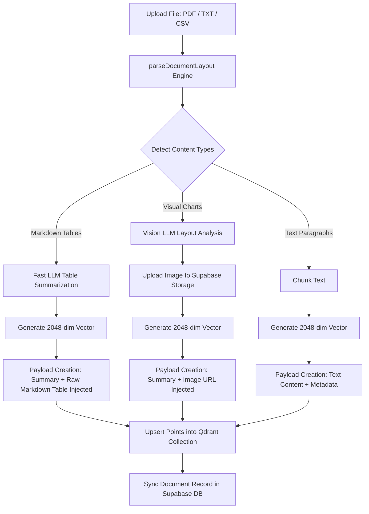
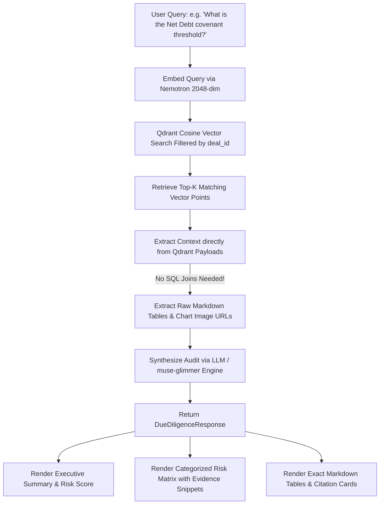

# 📊 LedgerClue — Financial Due Diligence & Multimodal RAG Engine

**LedgerClue** is an enterprise-grade financial Due Diligence copilot and forensic RAG (Retrieval-Augmented Generation) engine built for M&A deal team analysis, quality of earnings audits, debt covenant monitoring, and commercial risk assessment.

Powered by **Next.js 16**, **Qdrant Vector Database** (2048-dim vectors), **NVIDIA Nemotron-3-embed-1b**, and **Supabase**, LedgerClue eliminates relational SQL join bottlenecks by injecting parent markdown tables and visual chart assets directly into Qdrant vector payloads.

---

## 🚀 Key Features

- **📄 Layout-Aware Document Parsing & Nemotron OCR v2**  
  Extracts financial tables, debt schedules, income statements, and charts from complex PDFs, TXTs, CSVs, and Markdown files—even for custom-font or image-based financial disclosures.
  
- **🧩 Parent-Child Markdown Table Ingestion**  
  Summarizes complex tables via Fast LLM for semantic vector search, while embedding raw parent Markdown tables directly into Qdrant point payloads. Retrieval returns exact, un-truncated tables without database lookup latency.

- **🖼️ Multimodal Chart & Visual Asset Storage**  
  Parses visual financial diagrams (pie charts, trend graphs, segment breakdowns) with Vision LLMs, stores processed images in Supabase Storage, and embeds direct visual URLs in Qdrant payloads for instant user verification.

- **🎯 Deal-Scoped Vector Retrieval**  
  Restricts vector searches strictly by `deal_id` metadata payload filters to guarantee strict data isolation across target portfolio companies.

- **⚡ High-Precision 2048-Dim Embeddings**  
  Employs `nvidia/nemotron-3-embed-1b` (2048 vector dimensions) for high-density financial concept mapping.

- **🛡️ Forensic Risk Matrix & Automated Audit Response**  
  Generates executive summaries, risk severity scores (0–100), structured risk items (Financial Anomalies, Debt Covenants, Customer Concentration), page citations, and evidence snippets.

- **🔄 Zero-Config In-Memory Fallback Engines**  
  Includes instant fallbacks for Qdrant and Supabase. The platform runs smoothly out of the box for demonstration and development without requiring external server dependencies.

- **🔍 Payload Inspector & SQL Schema Exporter**  
  Built-in UI tools to visually inspect raw Qdrant vector payloads, search scores, and export PostgreSQL schema scripts for Supabase.

---

## 🛠️ Architecture & Tech Stack

| Layer | Technology |
| :--- | :--- |
| **Framework** | [Next.js 16](https://nextjs.org/) (App Router, Server Actions, React 19) |
| **Styling & UI** | Tailwind CSS v4, Lucide Icons, Framer Motion |
| **Vector Engine** | [Qdrant](https://qdrant.tech/) REST Client (2048-dim Cosine distance) |
| **Relational Metadata** | [Supabase](https://supabase.com/) (PostgreSQL & Storage Buckets) |
| **Embedding Model** | NVIDIA Nemotron-3-embed-1b (2048 dimensions) |
| **Document Parsing** | `pdf-parse`, `pdfjs-dist`, Nemotron OCR v2 (`meta/llama-3.2-11b-vision-instruct`, `nvidia/neva-22b`) |
| **LLM Reasoning** | OpenAI API / NVIDIA API (`meta/llama-3.1-8b-instruct`, `muse-glimmer-30b`, GPT-4o mini) |
| **Testing** | Vitest (Unit Testing), Playwright (E2E Testing) |

---

## 📁 Project Structure

```
ledgerclue/
├── app/
│   ├── api/
│   │   ├── deals/              # Fetch & create M&A target deals
│   │   ├── documents/          # Document metadata & deal association
│   │   ├── ingest/             # Document ingestion endpoint
│   │   ├── qdrant-inspector/   # Inspection API for Qdrant points
│   │   └── query/              # RAG due diligence query execution
│   ├── favicon.ico
│   ├── globals.css             # Tailwind v4 theme & global styles
│   ├── layout.tsx              # Root HTML layout & font definitions
│   └── page.tsx                # Main SPA workspace (Audit, Ingest, Qdrant UI)
├── components/
│   ├── DealSelectorModal.tsx   # Target deal switcher & creator modal
│   ├── DocumentUploader.tsx    # Drag-and-drop file uploader & status logs
│   ├── Navbar.tsx              # Application header & tab navigation
│   ├── PayloadInspector.tsx    # Qdrant 2048-dim vector point payload viewer
│   ├── RagChat.tsx             # Interactive Due Diligence Audit & Risk Matrix UI
│   └── SqlSetupModal.tsx       # Supabase SQL table creation script generator
├── lib/
│   ├── embeddings.ts           # 2048-dim Nemotron embedding generator & fallback
│   ├── ingestion.ts            # Parent-child parsing & vector ingestion engine
│   ├── ocr.ts                  # Nemotron OCR v2 visual extraction pipeline
│   ├── parser.ts               # Layout-aware PDF/TXT parser & Markdown table formatter
│   ├── qdrant.ts               # Qdrant vector client & in-memory payload store
│   ├── rag.ts                  # Multimodal RAG query execution & audit synthesis
│   ├── supabase.ts             # Supabase DB client & in-memory database store
│   └── types.ts                # TypeScript interfaces (QdrantPayload, RiskItem, etc.)
├── e2e/                        # Playwright end-to-end test suites
├── public/                     # Static assets
├── .env.example                # Template for environment variables
├── package.json
└── tsconfig.json
```

---

## ⚙️ How Ingestion Works



### Ingestion Steps Breakdown

1. **Layout-Aware Extraction & OCR**:
   - The document is parsed by `lib/parser.ts`.
   - Text streams are inspected for tabular rows (`|`, tab alignments, multi-column metrics) and converted into clean **Markdown tables**.
   - For custom-font or image-heavy PDFs, **Nemotron OCR v2** (`lib/ocr.ts`) or an AI layout restorer is automatically invoked.

2. **Parent-Child Table Indexing**:
   - Instead of losing structured table formatting, tables are summarized by a Fast LLM into semantic concepts for dense vector matching.
   - The original raw parent Markdown table is stored **directly inside the Qdrant payload** under `raw_markdown`.

3. **Multimodal Chart Indexing**:
   - Visual diagrams are analyzed via Vision LLMs (`meta/llama-3.2-11b-vision-instruct` / `neva-22b`).
   - The original chart image is uploaded to Supabase Storage (`financial-charts` bucket), and the `image_url` is added to the Qdrant payload.

4. **2048-Dim Vector Embedding**:
   - Semantic summaries and text chunks are converted to **2048-dimensional vectors** using `nvidia/nemotron-3-embed-1b` (with deterministic fallback).

5. **Qdrant Storage & Metadata Sync**:
   - Points are upserted into Qdrant with filters for `deal_id`, `document_id`, `page_number`, `financial_category`, and `section_heading`.

---

## 🔎 How Retrieval (RAG Engine) Works



### Retrieval Steps Breakdown

1. **Deal-Filtered Vector Query**:
   - The user's query is converted to a 2048-dimensional vector via `generateNemotronEmbedding()`.
   - Qdrant searches the `financial_due_diligence_2048` collection using a payload match filter for `deal_id`.

2. **Direct Context Extraction (No SQL Joins)**:
   - Retrieved payload items contain the text snippet, page number, section heading, **raw parent markdown tables**, and **chart image URLs**.
   - Context is constructed immediately without secondary database roundtrips.

3. **Forensic Audit Synthesis**:
   - The context is passed to the LLM (`muse-glimmer-30b`, `meta/llama-3.1-8b-instruct`, or fallback auditor).
   - The LLM returns a structured JSON payload containing:
     - `answer`: Full markdown audit report.
     - `executive_summary`: 2-sentence summary.
     - `risk_score`: Numeric score (0–100).
     - `risks`: Array of risk items with `category`, `severity` (HIGH/MEDIUM/LOW), `title`, `description`, `evidence_snippet`, and `page_reference`.
     - `citations`: Exact document source links with relevance scores.

---

## 🛞 Zero-Config Demo Mode (In-Memory Fallbacks)

LedgerClue is built to work seamlessly even without external services running:

- **Qdrant Offline Fallback**: If a Qdrant server is unreachable at `QDRANT_URL`, LedgerClue switches to an internal memory map and computes cosine vector similarity directly in Node.js.
- **Supabase Offline Fallback**: If Supabase credentials are not provided, deal states and document metadata are safely stored in memory during the active session.
- **NVIDIA / OpenAI Offline Fallback**: If API keys are missing, LedgerClue generates deterministic 2048-dimensional unit-norm vectors and provides forensic auditor reasoning logic.

---

## 🚦 Getting Started

### Prerequisites

- **Node.js**: v18.x or v20.x
- **npm** / **yarn** / **pnpm** / **bun**

### Installation

1. **Clone the repository**:
   ```bash
   git clone https://github.com/abysbyte/ledgerclue.git
   cd ledgerclue
   ```

2. **Install dependencies**:
   ```bash
   npm install
   ```

3. **Configure Environment Variables**:
   Copy `.env.example` to `.env.local`:
   ```bash
   cp .env.example .env.local
   ```

4. **Start the Development Server**:
   ```bash
   npm run dev
   ```
   Open [http://localhost:3000](http://localhost:3000) in your browser.

---

## 🔑 Environment Variables Reference

| Variable | Description | Default / Example |
| :--- | :--- | :--- |
| `NVIDIA_API_KEY` | Key for NVIDIA API (Nemotron embeddings & Llama LLMs) | `nvapi-...` |
| `OPENAI_API_KEY` | Key for OpenAI API (Fallback for LLM & embeddings) | `sk-...` |
| `QDRANT_URL` | URL of Qdrant vector database server | `http://localhost:6333` |
| `QDRANT_API_KEY` | API Key for authenticated Qdrant instances | `your_qdrant_key` |
| `NEXT_PUBLIC_SUPABASE_URL` | Supabase project URL | `https://xyz.supabase.co` |
| `SUPABASE_SERVICE_ROLE_KEY` | Supabase service role API key | `ey...` |
| `LLM_MODEL_NAME` | Primary LLM model identifier | `meta/llama-3.1-8b-instruct` |
| `LLM_BASE_URL` | Optional custom OpenAI-compatible endpoint | `https://integrate.api.nvidia.com/v1` |

---

## 🧪 Testing & Verification

- **Run Unit Tests (Vitest)**:
  ```bash
   npm test
  ```
- **Run End-to-End Tests (Playwright)**:
  ```bash
  npm run test:e2e
  ```
- **Build Production Bundle**:
  ```bash
  npm run build
  ```

---

## 📜 License

Distributed under the MIT License. See `LICENSE` for details.
